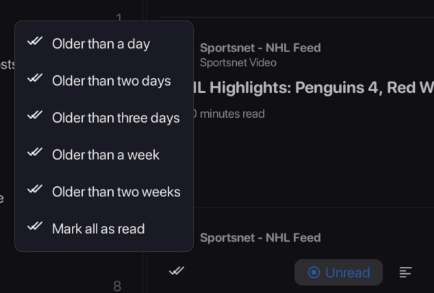

# A few words about this fork

This fork was created to add some stuff that I was sorely missing from the original excellent work the ReactFlux dev have done, such as:

- Resizable panes
- Mark as read functionality based on days
  

- AI Summarization of articles
- New Content section contains old feed + article three dot menu options, plus new colour and global font setting for the whole app.
  
  

- Some theme changes I was applying with Tampermonkey up until now.


- Some other stuff as well (Greek localization support, clicking on feeds/categories always refreshes the feed, etc.)

This fork is not thoroughly tested (even though I use it every day) and I bet some stuff are broken because of these additions. Using LLMs just for fun to make these additions probably didn't help either. So, the usual; use at your own peril etc.

What follows is the original README contents from electh/ReactFlux:main.

# ReactFlux

Read in other languages: [Deutsch](docs/README.de-DE.md), [Español](docs/README.es-ES.md), [Français](docs/README.fr-FR.md), [简体中文](docs/README.zh-CN.md)

## Overview

ReactFlux is a third-party web frontend for [Miniflux](https://github.com/miniflux/v2), aimed at providing a more user-friendly reading experience.

Supported Miniflux versions: 2.1.4 and higher.

Key features include:

- Modern interface design
- Responsive layout with touch gestures support
- Support for dark mode and custom themes
- Customizable reading experience:
  - Font family and size settings
  - Article width adjustment
  - Title alignment options
  - Image viewer with zoom and slideshow
  - Footnotes enhancement
  - Code syntax highlighting
  - Estimated reading time
- Article and feed management:
  - Google-like syntax for search
  - Filter articles by read status, publish date, title, content, or author
  - Batch operations for feeds
  - Full-text fetching support
  - De-duplicate articles by hash, title, or URL
  - Auto mark articles as read while scrolling
- Advanced features:
  - Keyboard shortcuts (customizable)
  - Batch update the host of filtered subscription URLs (useful for replacing RSSHub instances)
  - Batch refresh errored subscriptions
  - Save articles to third-party services
- I18n supports (Deutsch / English / Español / Français / 简体中文)
- Other features waiting for you to discover...

## Online Demo & Screenshots

Try ReactFlux with our [online demo instance](https://reactflux.pages.dev).

See how ReactFlux looks in different themes:


## Quick Start

1. Ensure you have a working Miniflux instance
2. Directly use our [online demo instance](https://reactflux.pages.dev) or deploy ReactFlux using one of the methods below
3. Log in using your Miniflux username and password or API key (recommended)

### Update Notification Source (Self-hosting/Forks)

The "update available" icon compares your current build metadata with a remote `version-info.json`.

By default it checks:

`https://raw.githubusercontent.com/Kombatant/ReactFlux/main/src/version-info.json`

If you use a fork, another branch, or your own release pipeline, set:

`VITE_VERSION_INFO_URL=https://your-source/version-info.json`

Then rebuild so the setting is embedded in the app.

For troubleshooting, you can also enable:

`VITE_VERSION_CHECK_DEBUG=true`

This prints version-check decisions and compared metadata in the browser console.

## Deployment

### Cloudflare Pages

ReactFlux is built with React and generates a set of static web files after building, which can be directly deployed on Cloudflare Pages.

You can deploy it on Cloudflare Pages by selecting `Framework preset` as `Create React App`.

### Using Pre-built Files

You can download the pre-built files from the `gh-pages` branch and deploy them to any static hosting service that supports single-page applications (SPA).

Make sure to configure URL rewriting to redirect all requests to `index.html`.

If you are deploying using Nginx, you might need to add the following configuration:

```nginx
location / {
    try_files $uri $uri/ /index.html;
}
```

Or using Caddy, you might need to add the following configuration:

```caddyfile
try_files {path} {path}/ /index.html
```

### Vercel

[](https://vercel.com/import/project?template=https://github.com/electh/ReactFlux)

### Docker

[](https://hub.docker.com/r/electh/reactflux)

```bash
docker run -p 2000:2000 electh/reactflux
```

Or using [Docker Compose](docker-compose.yml):

```bash
docker-compose up -d
```

<!-- ### Zeabur (Outdated, unrecommended)

[](https://zeabur.com/templates/OKXO3W) -->

## Translation Guide

To help us translate ReactFlux into your language, please contribute to the `locales` folder and send a pull request.

Additionally, you need to add a README file for the respective language and reference it in all existing README files.

You should also modify parts of the source code to include the i18n language packages for `Arco Design` and `Day.js`.

For detailed changes, please refer to the modifications in [PR #145](https://github.com/electh/ReactFlux/pull/145).

### Current Translators

| Language | Translator                                      |
| -------- | ----------------------------------------------- |
| Deutsch  | [DonkeeeyKong](https://github.com/donkeeeykong) |
| Español  | [Victorhck](https://github.com/victorhck)       |
| Français | [MickGe](https://github.com/MickGe)             |
| 简体中文 | [Neko Aria](https://github.com/NekoAria)        |

## Contributors

> Thanks to all the contributors who have made this project more awesome!

<a href="https://github.com/electh/ReactFlux/graphs/contributors">
  
</a>

Made with [contrib.rocks](https://contrib.rocks).

## Star History

[](https://starchart.cc/electh/ReactFlux)
